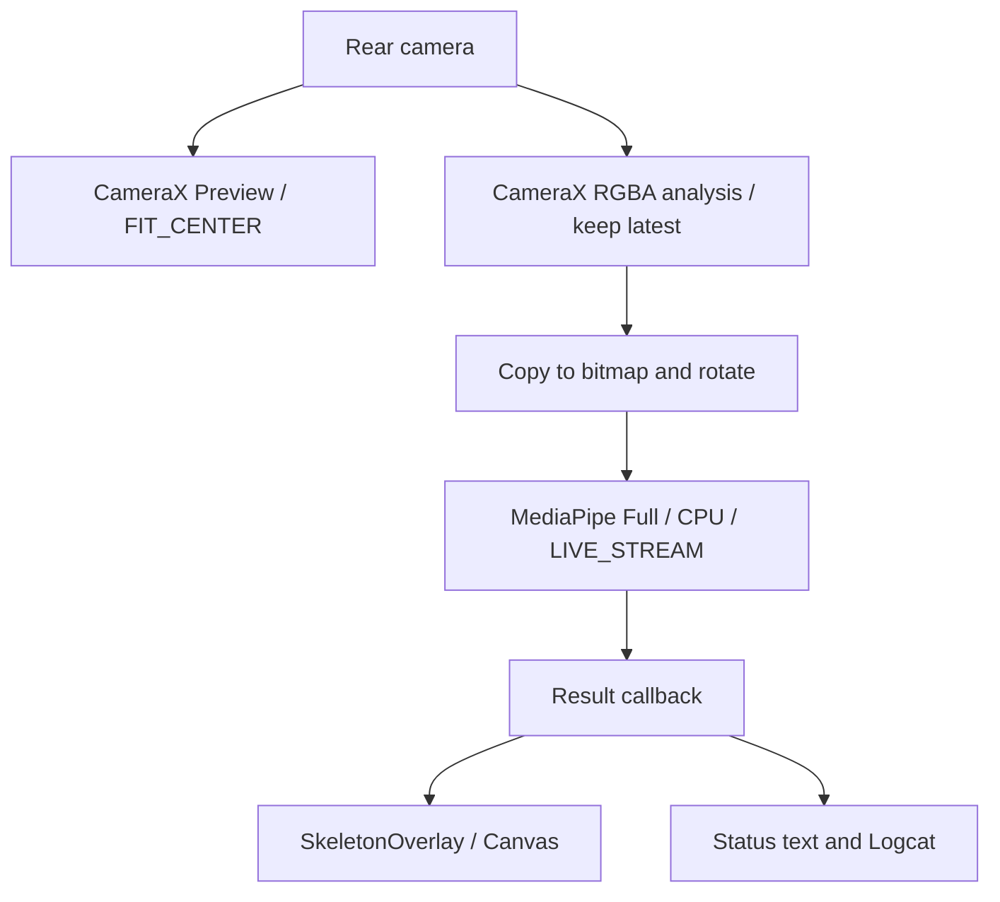

# PoseBenchmark

An Android prototype for observing live, on-device pose detection performance. It combines a rear-camera preview, a skeleton overlay, and a status panel using CameraX and the bundled MediaPipe Pose Landmarker Full model on CPU.

This repository implements an interactive benchmark viewer. It does not yet provide recorded benchmark sessions, statistical reports, or model/delegate comparisons. See the [product requirements document](PRD.md) for the current scope, acceptance criteria, and proposed improvements.

## Contents

- [Features](#features)
- [Build and run](#build-and-run)
- [Understanding the metrics](#understanding-the-metrics)
- [Architecture](#architecture)
- [Configuration](#configuration)
- [Validation and troubleshooting](#validation-and-troubleshooting)
- [Limitations and data handling](#limitations-and-data-handling)

## Features

- Requests camera permission and opens the default rear camera.
- Runs asynchronous, single-person pose detection with the CPU delegate.
- Draws red landmark points and green skeleton connections over a centered preview.
- Clears the skeleton when a result contains no pose.
- Displays result FPS, pose presence, landmark count, and callback latency approximately once per second.
- Writes performance and error messages to Logcat under `PoseBenchmark`.
- Loads the model from app assets; there is no runtime model download in the application code.

## Build and run

### Repository configuration

These are the versions declared in the repository, not a claim about the latest available releases.

| Component | Configured value |
| --- | --- |
| Application ID / namespace | `com.example.posebenchmark` |
| App version | `1.0` (`versionCode = 1`) |
| Minimum Android API | 24 |
| Compile / target API | 37 / 37 |
| Android Gradle Plugin | 9.4.0 |
| Gradle wrapper | 9.6.0 |
| Gradle daemon JVM criteria | Java 25 |
| Java source / target compatibility | 11 |
| CameraX | 1.6.2 |
| MediaPipe Tasks Vision | 1.0.0 |
| Activity KTX / Material Components | 1.11.0 / 1.12.0 |

Use Android Studio with support for the configured build tools, an Android SDK installation containing API 37, and a Java installation available to the Gradle launcher. The checked-in daemon criteria request Java 25; source compatibility 11 is a separate setting. Dependency and toolchain resolution may require network access.

### Android Studio

1. Open the repository root as a project.
2. Configure the SDK location through Android Studio. The generated `local.properties` file is machine-specific and ignored by Git.
3. Configure the Gradle JDK and sync the project.
4. Select the `app` run configuration and an Android API 24+ device with a working rear camera.
5. Run the app and grant camera permission.
6. Point the rear camera at a person and observe the overlay and metrics. Use a physical device for representative performance measurements.

The required model is already included at [`app/src/main/assets/pose_landmarker_full.task`](app/src/main/assets/pose_landmarker_full.task), with a file size of 9,398,198 bytes. No additional model setup is implemented.

### Command line

From the repository root in PowerShell:

```powershell
.\gradlew.bat :app:assembleDebug
.\gradlew.bat :app:installDebug
```

On macOS or Linux, use `./gradlew` instead. Installation requires a connected device or running emulator. The debug APK is generated at `app/build/outputs/apk/debug/app-debug.apk` after a successful build.

If Java is unavailable, set `JAVA_HOME` to your installed JDK before running the wrapper. For a standard Windows Android Studio installation, its bundled runtime can serve as a launcher if present:

```powershell
$env:JAVA_HOME = 'C:\Program Files\Android\Android Studio\jbr'
.\gradlew.bat :app:assembleDebug
```

This session-local setting does not change the checked-in Java 25 daemon criteria.

## Understanding the metrics

| Display | Meaning in this implementation |
| --- | --- |
| `Pose FPS` | Number of result callbacks divided by elapsed wall time, including callbacks with no detected pose. It is not camera FPS or display FPS. |
| `Pose` | Whether the most recent result used for the status refresh contains landmarks. |
| `Landmarks` | Number of landmarks in the first detected pose, or zero when absent. The skeleton connections use indices 0 through 32. |
| `Latency` | `SystemClock.uptimeMillis() - result.timestampMs()` at result handling. The submitted timestamp is captured before bitmap conversion and rotation, so this includes preprocessing and asynchronous processing up to the callback. It excludes final screen rendering and is not isolated model inference time. |

The status refresh occurs on a result callback after at least 1,000 ms. Latency is the latest sample, not an average or percentile. If callbacks stop, the text can remain stale. The first FPS window begins after model creation, so camera startup delay can affect it. Camera analysis uses `STRATEGY_KEEP_ONLY_LATEST`; there is no dropped-frame counter.

For manual comparisons, record the device, OS, build type, lighting, framing, orientation, and observation duration. Allow startup to settle and keep conditions consistent. The repository contains no validated performance baseline or guaranteed FPS target.

## Architecture

The app uses programmatically constructed Android Views in a single `ComponentActivity`.



`MainActivity` owns permission handling, camera binding, model initialization, frame conversion, result handling, and cleanup. Model initialization and camera analysis share a single-thread executor. Status text changes are posted to the UI thread; overlay data is assigned from the result callback and redraws use `postInvalidate()`.

`SkeletonOverlay` scales normalized coordinates to the analyzed image dimensions, applies a fit-center scale and offsets, and draws connections and points. This assumes that preview and analysis image geometry match; device-specific alignment still needs validation.

On activity destruction, model closure is queued on the executor and the executor is shut down. Camera use cases are bound to the activity lifecycle.

### Project map

| Path | Responsibility |
| --- | --- |
| [`MainActivity.kt`](app/src/main/java/com/example/posebenchmark/MainActivity.kt) | Camera, inference pipeline, UI, metrics, lifecycle |
| [`SkeletonOverlay.kt`](app/src/main/java/com/example/posebenchmark/SkeletonOverlay.kt) | Production skeleton rendering |
| `app/src/main/assets/` | Bundled pose model |
| [`AndroidManifest.xml`](app/src/main/AndroidManifest.xml) | Camera permission, launcher activity, backup configuration |
| `app/src/main/res/` | App name, themes, colors, icons, template backup rules |
| [`app/build.gradle.kts`](app/build.gradle.kts) | SDK levels, dependencies, build configuration |
| [`gradle/libs.versions.toml`](gradle/libs.versions.toml) | AGP version and additional library aliases; some aliases are unused |
| `gradle/wrapper/`, `gradle/gradle-daemon-jvm.properties` | Gradle distribution and daemon toolchain criteria |
| `app/src/test/`, `app/src/androidTest/` | Template tests; local tests also contain a second overlay implementation |
| `app/src/main/keepRules/rules.keep` | R8 rule template; release optimization is disabled in the build configuration |

## Configuration

There are no runtime settings. Edit `MainActivity.kt` to change these values:

| Setting | Current value |
| --- | --- |
| Model asset | `pose_landmarker_full.task` |
| Delegate | `Delegate.CPU` |
| Running mode | `RunningMode.LIVE_STREAM` |
| Maximum poses | 1 |
| Detection / presence / tracking confidence | 0.5 / 0.5 / 0.5 |
| Camera | `DEFAULT_BACK_CAMERA` |
| Analysis output | `RGBA_8888` |
| Backpressure | `STRATEGY_KEEP_ONLY_LATEST` |
| Preview scale | `FIT_CENTER` |

Camera resolution and target frame rate are not explicitly fixed. Changing the model or delegate requires code changes and validation; GPU benchmarking is only mentioned as a future intention in a code comment.

## Validation and troubleshooting

### Automated checks

Review outcome (2026-09-07): using Android Studio's bundled runtime to launch Gradle, `:app:assembleDebug` completed successfully. The combined build/test invocation then failed at `:app:compileDebugUnitTestKotlin` because JUnit imports, `Test`, and `assertEquals` were unresolved. No device tests or lint run were performed during this documentation review.

```powershell
.\gradlew.bat :app:testDebugUnitTest
.\gradlew.bat :app:lintDebug
.\gradlew.bat :app:connectedDebugAndroidTest
```

The current tests only check arithmetic and the application package name. The app dependency block does not declare the JUnit/AndroidX test dependencies those sources import. The version catalog contains test aliases, but they are not wired into the module. Test setup needs repair before these commands can be treated as a working validation suite. `src/test` also defines a second `com.example.posebenchmark.SkeletonOverlay`; it is not a rendering test and should be reconciled with the production class.

### Manual smoke test

1. Launch with camera permission unset; verify both grant and denial behavior.
2. With permission granted, verify preview, model loading, skeleton display, and status refresh.
3. Move the person out of view; verify the next empty result clears the skeleton.
4. Rotate the device and inspect skeleton alignment and letterboxing.
5. Background, resume, close, and reopen the app; inspect Logcat for camera or model errors.
6. Run continuously on a physical device and observe metric stability and heating.

### Common symptoms

| Symptom | Where to check |
| --- | --- |
| Wrapper cannot find Java | Set `JAVA_HOME` or configure the IDE Gradle JDK. |
| SDK or dependency resolution fails | Confirm the configured API/toolchain and access to the declared repositories. |
| `Camera permission is required` | Grant camera access in Android settings and reopen the app; there is no in-app retry control. |
| `Unable to start camera` | Check rear-camera availability and Logcat's `Camera failed` entry. Camera hardware is optional in the manifest, but the app always selects the rear camera. |
| `MediaPipe model failed to load` | Check the bundled asset and `Could not load Pose Landmarker` log entry. |
| No skeleton or frozen metrics | Inspect `MediaPipe error`, `Frame conversion failed`, and `Pose detection failed` logs; these errors do not have a dedicated recovery screen. |
| Skeleton offset or stretched | Validate preview/analysis geometry and rotation on the device; the renderer uses manual fit-center mapping. |

## Limitations and data handling

- No front-camera switch, GPU selector, alternate model selector, multiperson mode, recording, export, or session history.
- No warm-up exclusion, latency distribution, thermal measurement, power measurement, or accuracy evaluation.
- Each analyzed frame creates a bitmap and performs rotation; allocation overhead can affect results.
- Overlay state is shared between callback and drawing threads without an explicit synchronized snapshot. Result dimensions come from mutable latest-frame fields, rather than a per-result association.
- The frame-copy path does not explicitly account for RGBA row padding. Rotation, frame layout, and lifecycle behavior need device testing.
- UI status strings are hardcoded in English and several dimensions use raw pixels; accessibility, localization, and system-inset behavior are not validated.

The reviewed application code processes camera images in memory and does not implement image/video persistence, uploads, accounts, or analytics. The source manifest declares camera permission and no internet permission. Android backup is enabled with template rules; revisit these if persistent data is introduced. This source review is not a dependency-wide privacy audit.

No project license or separate model provenance/license documentation is present. Establish the applicable code and model redistribution terms before distributing the project.
